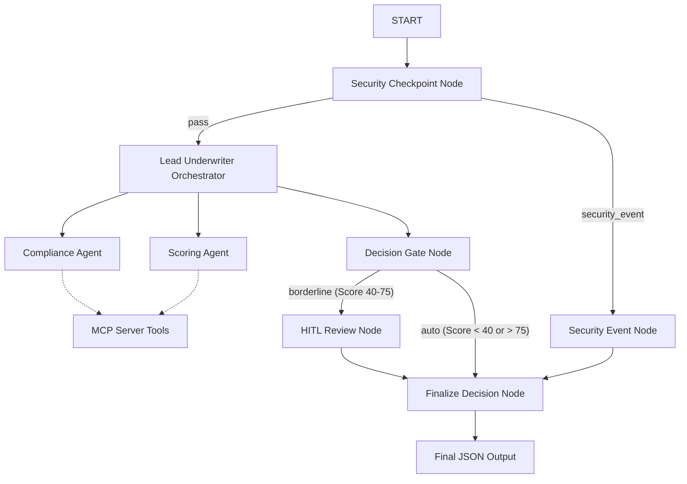
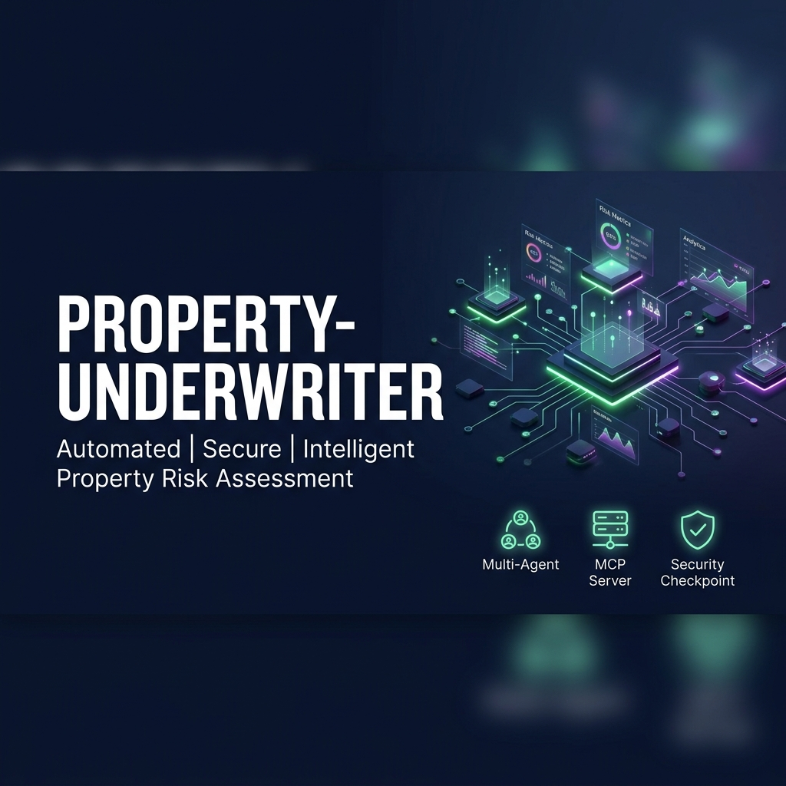
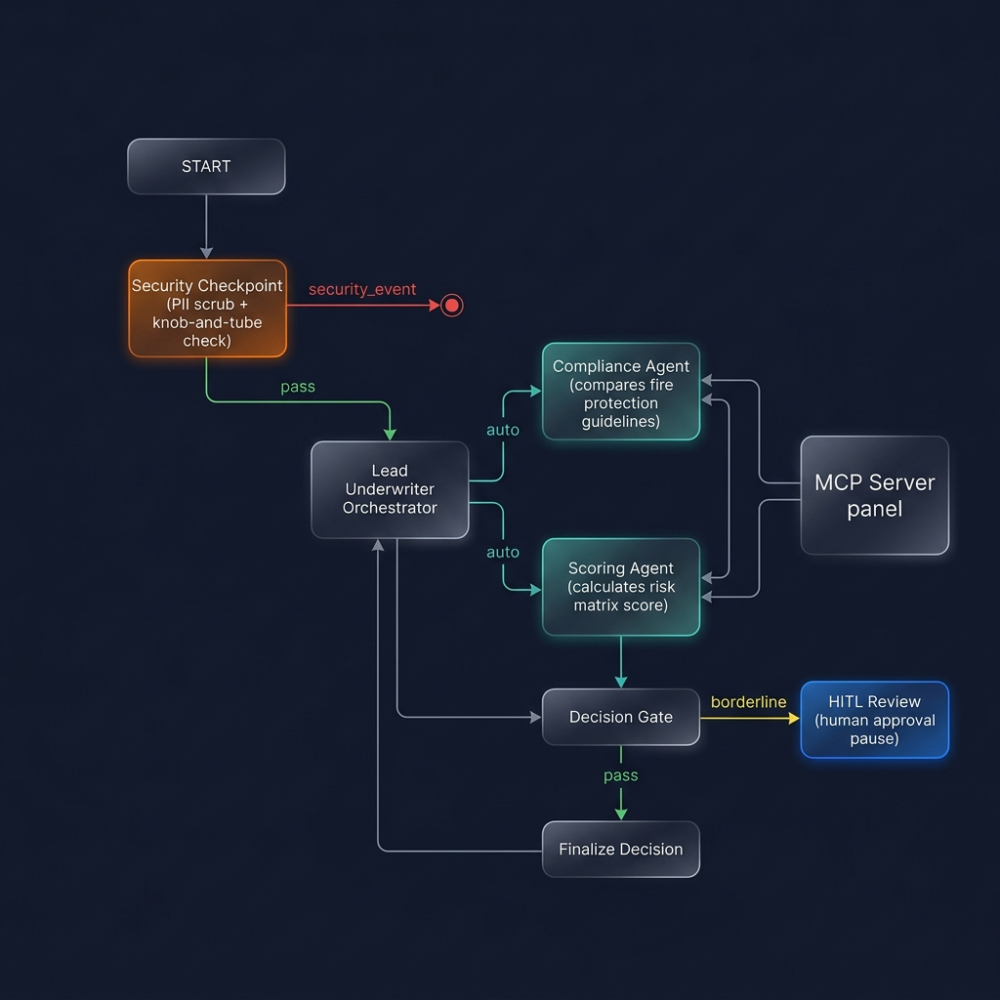

# Property Underwriter Risk Assessment Agent

Automated multi-agent workflow for assessing and scoring property risks against compliance standards and underwriting guidelines.

## Project Structure

```text
property-underwriter/
├── app/                  # Core agent code
│   ├── agent.py          # Main multi-agent workflow graph
│   ├── config.py         # Universal config values
│   ├── mcp_server.py     # FastMCP server with local filesystem tools
│   └── fast_api_app.py   # FastAPI server adapter
├── assets/               # Generated submission assets
│   ├── architecture_diagram.png
│   └── cover_page_banner.png
├── tests/                # Unit, integration, and load tests
├── pyproject.toml        # Pinned project dependencies
└── Makefile              # Build and run commands
```

---

## Prerequisites

- **Python 3.11 or higher**
- **`uv`**: Fast Python package manager — [Install](https://docs.astral.sh/uv/getting-started/installation/)
- **Gemini API Key** from [aistudio.google.com/apikey](https://aistudio.google.com/apikey)

---

## Quick Start

1. **Clone and Configure**:
   ```bash
   git clone <repo-url>
   cd property-underwriter
   cp .env.example .env   # Add your GOOGLE_API_KEY
   ```
2. **Build and Run**:
   ```bash
   make install           # Syncs virtualenv dependencies
   make playground        # Opens the Developer Web UI at http://localhost:18081
   ```

---

## Solution Architecture



---

## How to Run

- **Playground (Interactive Test UI)**:
  Runs the interactive web UI at http://localhost:18081:
  ```bash
  make playground
  ```
- **FastAPI Web Server (Production API)**:
  Launches the local web server endpoint at port 8000:
  ```bash
  make run
  ```

---

## Sample Test Cases

### 1. Auto-Approve (Low Risk)
- **Input**:
  ```text
  Property Questionnaire
  Building Age: 5 years
  Sprinkler System: Fully Sprinklered (Wet pipe)
  Distance to Hydrant: 150 feet
  Wiring: Copper
  ```
- **Expected**: Routes to orchestrator. Compliance agent passes. Scoring agent applies matrix (Base 50 - 20 for Sprinkler = 30). Score (30) is < 40. Decision gate routes to "auto" -> Auto-Approved.
- **Check**: Final JSON contains `"status": "AUTO_APPROVED"` and `"overall_score": 30.0`.

### 2. Manual Review (Medium / Borderline Risk)
- **Input**:
  ```text
  Property Questionnaire
  Policyholder Name: Alice Smith (Phone: 555-019-2834, email: alice.smith@example.com)
  Building Age: 10 years
  Sprinkler System: None
  Distance to Hydrant: 200 feet
  ```
- **Expected**: Security checkpoint scrubs name, phone, and email. Compliance agent notes lack of sprinkler. Scoring agent applies matrix (Base 50 + No Sprinklers 20 = 70). Score (70) is in 40-75 range. Decision gate routes to "borderline" -> workflow pauses at HITL node waiting for underwriter approval.
- **Check**: In the UI, a prompt is shown asking for Underwriter Approval. Submit approval to finalize.

### 3. Immediate Reject (Prohibited Hazard / Security Event)
- **Input**:
  ```text
  Property Questionnaire
  Building Age: 50 years
  Wiring: Prohibited knob-and-tube wiring
  ```
- **Expected**: Security checkpoint detects prohibited wiring type. Node immediately routes to "security_event" (skipping orchestrator/sub-agents) -> Finalize Decision.
- **Check**: Final JSON contains `"status": "REJECTED_SECURITY"` and `"recommendation"` explaining the safety violation.

---

## Demo Script

A spoken presentation script is available in [DEMO_SCRIPT.txt](file:///c:/Users/arsri/workspaces/adk-workspace/property-underwriter/DEMO_SCRIPT.txt) to guide you during UI walks.

---

## Assets

### Cover Page Banner


### Workflow Diagram


---

## Troubleshooting

1. **429 Resource Exhausted / Rate Limit**:
   If the Gemini API returns a 429 quota error, open `.env` and change `GEMINI_MODEL` to `gemini-2.5-flash-lite`, which has higher free-tier limits.
2. **"no agents found" on Windows Start**:
   Ensure you run the playground command inside the project directory `property-underwriter/` and use the directory name `app` explicitly as `<agent_dir>`.
3. **Changes in agent.py not reflecting**:
   Windows disables live hot-reload to avoid event loop locks. Stop the server completely by running:
   ```powershell
   Get-Process -Id (Get-NetTCPConnection -LocalPort 18081, 8090 -ErrorAction SilentlyContinue).OwningProcess | Stop-Process -Force
   ```
   Then run `make playground` again to start fresh.

---

## Push to GitHub

1. Create a new repo at https://github.com/new
   - Name: property-underwriter
   - Visibility: Public or Private
   - Do NOT initialize with README (you already have one)

2. In your terminal, navigate into your project folder:
   ```bash
   cd property-underwriter
   git init
   git add .
   git commit -m "Initial commit: property-underwriter ADK agent"
   git branch -M main
   git remote add origin https://github.com/<your-username>/property-underwriter.git
   git push -u origin main
   ```

3. Verify .gitignore includes:
   ```text
   .env          ← your API key — must NEVER be pushed
   .venv/
   __pycache__/
   *.pyc
   .adk/
   ```

⚠️ NEVER push .env to GitHub. Your API key will be exposed publicly.
