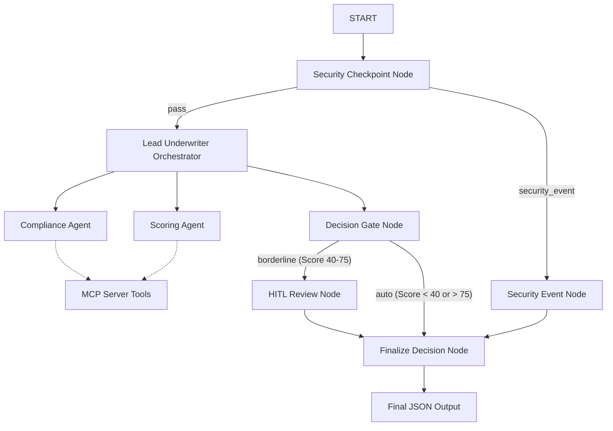

# Submission Write-Up: Property Underwriter Risk Assessment Agent

## Problem Statement

Property risk assessment in insurance underwriting is a complex, manual process. Underwriters must comb through lengthy property risk questionnaires, verify compliance against dozens of pages of fire protection standards and underwriting guidelines, and manually calculate scores using rigid risk matrices. This manual ingestion is:
- **Time-Consuming**: Processing a single application can take hours.
- **Error-Prone**: Compliance guidelines and score adjustments are easily missed.
- **Inconsistent**: Different underwriters might score borderline risk indicators subjectively.

The **Property Underwriter Risk Assessment Agent** automates the ingestion, validation, scoring, and review of risk questionnaires, improving turnaround speed and consistency while keeping human underwriters firmly in control of borderline decisions.

## Solution Architecture

## Concepts Used

- **ADK Workflow**: The entire control flow is orchestrating by an ADK 2.0 graph-based `Workflow` class in [app/agent.py](file:///c:/Users/arsri/workspaces/adk-workspace/property-underwriter/app/agent.py#L245-L258) using explicit `Edge` connections to guarantee deterministic routing.
- **LlmAgent / Agent**: Specialized sub-agents (`compliance_agent` and `scoring_agent`) are defined in [app/agent.py](file:///c:/Users/arsri/workspaces/adk-workspace/property-underwriter/app/agent.py#L15-L39) to handle specific sub-tasks instead of a single monolithic prompt.
- **AgentTool**: The orchestrator (`underwriter_orchestrator`) utilizes `AgentTool` in [app/agent.py](file:///c:/Users/arsri/workspaces/adk-workspace/property-underwriter/app/agent.py#L68-L71) to delegate sub-tasks to the compliance and scoring sub-agents.
- **MCP Server**: FastMCP server in [app/mcp_server.py](file:///c:/Users/arsri/workspaces/adk-workspace/property-underwriter/app/mcp_server.py) exposes tools to parse PDFs and read local standards, guidelines, and matrices. It is wired into both sub-agents via `MCPToolset` in [app/agent.py](file:///c:/Users/arsri/workspaces/adk-workspace/property-underwriter/app/agent.py#L28-L41).
- **Security Checkpoint**: The `security_checkpoint` workflow function node in [app/agent.py](file:///c:/Users/arsri/workspaces/adk-workspace/property-underwriter/app/agent.py#L74-L121) scrubs PII, deters prompt injection, and applies a domain safety rule to intercept knob-and-tube hazards.
- **Agents CLI**: Project scaffolded and run locally via `agents-cli` targets and Makefile configurations.

## Security Design

1. **PII Scrubbing**: Using regular expressions, the `security_checkpoint` scrubs customer emails, phone numbers, and SSNs. This protects policyholder privacy and complies with data protection regulations (e.g., GDPR, CCPA).
2. **Prompt Injection Mitigation**: Key phrases like "ignore instructions" are blocked, routing the session immediately to a termination path (`security_event`), preventing malicious prompt injections from hijacking scoring parameters.
3. **Domain-Specific Filter**: Knob-and-tube wiring is a prohibited commercial fire hazard. The checkpoint intercepts these applications instantly, bypassing downstream LLM invocations and saving API quota.
4. **Structured JSON Audit Logs**: The workflow prints JSON logs with structured fields (`severity`, `message`, `timestamp`) for tracking model decisions, compliance breaches, and routing choices.

## MCP Server Design

- `get_fire_protection_standards`: Exposes fire protection regulations, ensuring the compliance agent has direct, up-to-date access to distance requirements and sprinkler mandates.
- `get_underwriting_guidelines`: Retreives safety policy boundaries and building age criteria.
- `get_risk_scoring_matrix`: Exposes weighted risk rules, so the scoring agent calculates the risk score mathematically rather than heuristically.
- `parse_property_questionnaire`: Uses `pypdf` to read the submitted questionnaire file and convert it to structured text.

## Human-in-the-Loop (HITL) Flow

Underwriting involves high-stakes financial risk. Completely autonomous decisions on borderline cases can result in substantial losses or missed opportunities. 
- **Trigger**: When the scoring agent computes a risk score between **40 and 75**, the application is flagged as borderline.
- **Pause & Resume**: The `hitl_review` node in [app/agent.py](file:///c:/Users/arsri/workspaces/adk-workspace/property-underwriter/app/agent.py#L173-L192) suspends execution using `RequestInput`. It asks the user to review the score and indicate approval. The workflow only resumes after receiving this underwriter response, recording it in the final decision.

## Demo Walkthrough

Refer to the `Sample Test Cases` section in [README.md](file:///c:/Users/arsri/workspaces/adk-workspace/property-underwriter/README.md):
1. **Low Risk Case**: Returns auto-approved status without manual intervention.
2. **Borderline Risk Case**: Demonstrates the `RequestInput` dialog pausing the process for underwriter sign-off.
3. **Security Event Case**: Highlights immediate termination when knob-and-tube wiring is submitted.

## Impact & Value

- **Efficiency**: Reduces underwriting cycle time from hours to seconds.
- **Consistency**: Minimizes human error by verifying standards against the scoring matrix automatically.
- **Control**: Ensures underwriters maintain authority over borderline cases, combining the speed of AI with human discretion.
- **Privacy & Auditability**: Scrubs sensitive PII and leaves a complete, structured audit trail of all assessment decisions.
